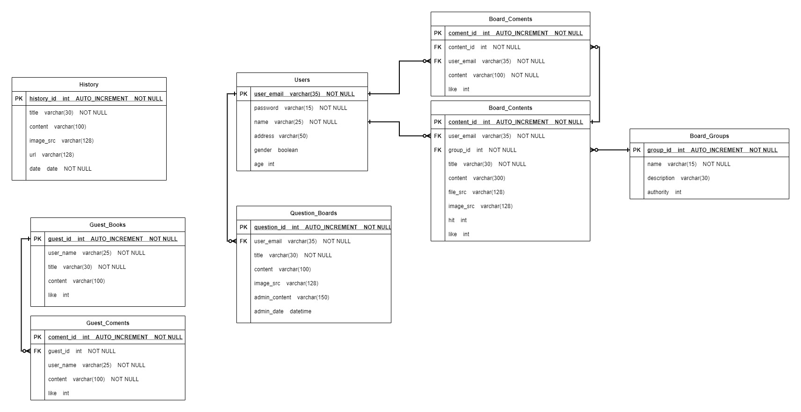

My Web(Blog)
=================
## 제작 계획

    <ul>
        <li>Front-End</li>
        <ul>
            <li>HTML, CSS, JavaScript</li>
            <li>BootStrap</li>
            <li>React(TypeScript)</li>
        </ul>
    </ul>
    <ul>
        <li>Back-End</li>
        <ul>
            <li>Node.js(TypeScript)</li>
            <li>TypeORM</li>
            <li>MariaDB 10.5.8v</li>
        </ul>
    </ul>
    <ul>
        <li>Application</li>
        <ul>
            <li>React-Native</li>
        </ul>
    </ul>
    <ul>
        <li>DevOps & ETC.</li>
        <ul>
            <li>Git</li>
            <li>Docker</li>
        </ul>
    </ul>
    <ul>
        <li>시도는 해볼 것</li>
        <ul>
            <li>OAuth</li>
            <li>Nginx</li>
            <li>next.js</li>
        </ul>
    </ul>

 

## Database 구성

#### 제작 기간 : `2021.02.13 ~
> 시간이 날 때마다 지속적으로 수정할 예정.

> typescript & typeorm 을 이용하여 초기제작하였다. 

## Web Router
- / (Index)
    - 추후 추가 예정